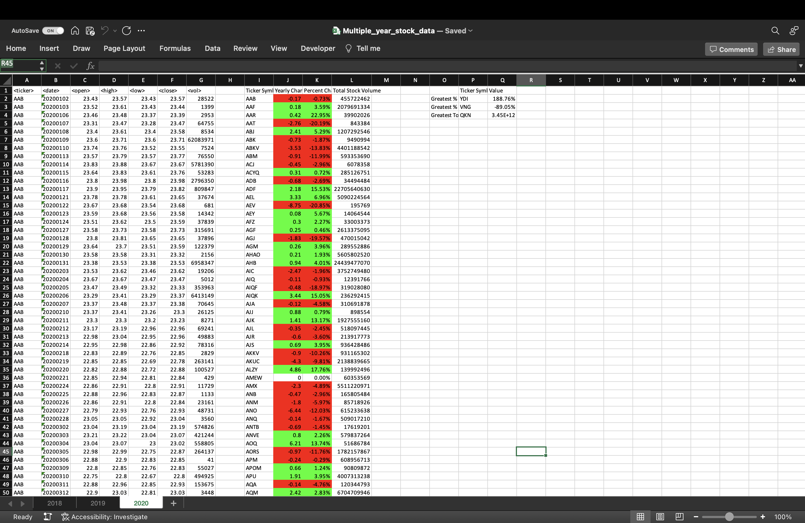

# VBA-challenge

This project employs VBA scripting to analyze simulated stock market data. The primary objective of this task was to develop a script capable of iterating through all stocks over a one-year period and producing the following information:

1.The ticker symbol.

2.Yearly change, representing the difference between the opening price at the beginning of the year and the closing price at the end of the year.

3.Percentage change, indicating the relative change from the opening price to the closing price over the year.

4.The total stock volume for each stock.

Furthermore, the script was enhanced with a summary table showcasing the most significant percentage increase, the most substantial percentage decrease, and the highest total volume. The script was executed across all worksheets, covering each year simultaneously. Here are the results:

YEAR 2018

YEAR 2019

YEAR 2020

